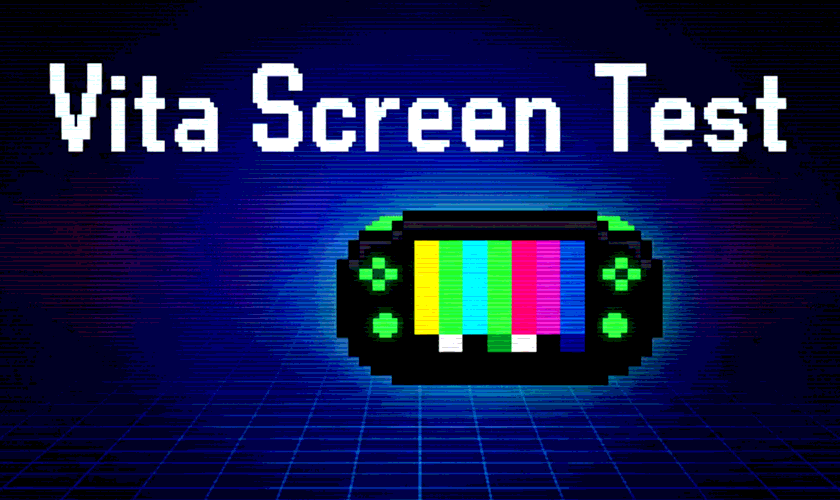

# Vita Screen Test

A screen test utility for the PlayStation Vita to help detect OLED burn-in and test display quality.



## Features

- **19 Test Patterns** including:
  - Solid colors (Red, Green, Blue, White, Black, Cyan, Magenta, Yellow)
  - Horizontal & Vertical gradients
  - Small & Large checkerboard patterns
  - Horizontal & Vertical color bars
  - Moving bar animations (horizontal & vertical)
  - Color cycle animation
  - Black/White inversion test
  - 16-level grayscale

- **Double-buffered rendering** for tear-free display
- **Welcome screen** with control instructions
- **Pattern indicator** showing current pattern number

## Controls

| Button | Action |
|--------|--------|
| **X / O** | Next pattern |
| **□ / △** | Previous pattern |
| **L / R** | Adjust animation speed |
| **SELECT** | Toggle pattern indicator |
| **START** | Exit application |

## Building

### Requirements

- [VitaSDK](https://vitasdk.org/) installed and configured
- CMake 3.16+

### Build Instructions

```bash
mkdir build && cd build
cmake ..
make
```

The VPK file will be generated at `build/vita_screen_test.vpk`.

## Installation

1. Transfer `vita_screen_test.vpk` to your PS Vita
2. Install using VitaShell or similar
3. Launch "Vita Screen Test" from the home screen

## Screenshots

The app displays various test patterns to help you identify any display issues:

- **Solid Colors**: Test individual color channels
- **Gradients**: Check for color banding
- **Checkerboards**: Detect dead pixels
- **Moving Bars**: Look for ghosting or response time issues
- **Gray Levels**: Verify contrast and black levels

## License

MIT License - Feel free to use and modify!

## Author

**Ibrahim Dogan**

---

Made with ❤️ for the PS Vita community
